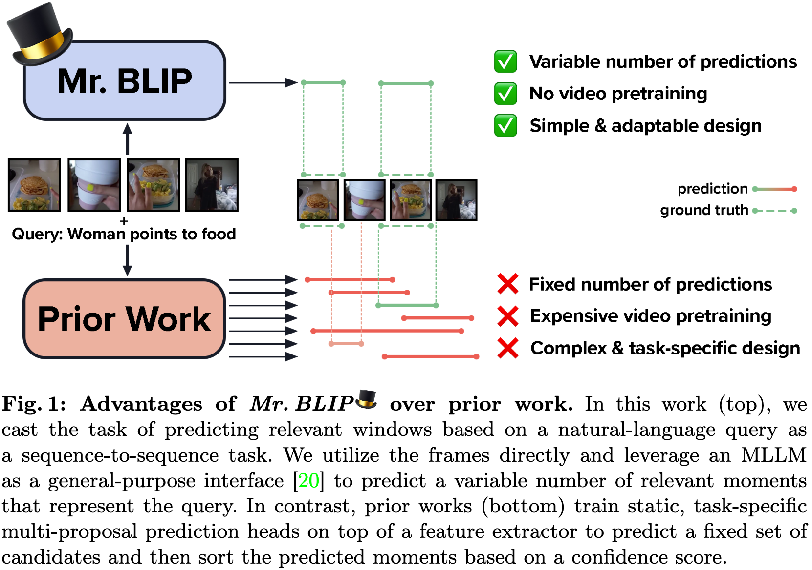
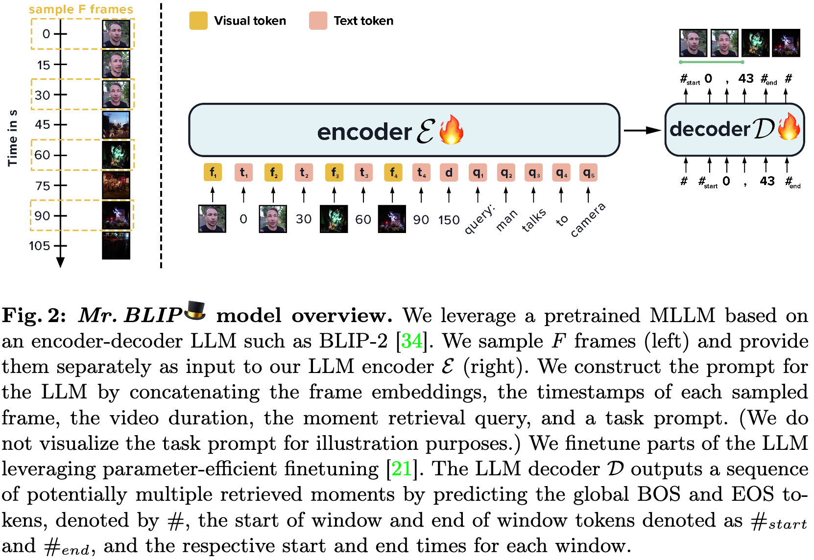

# The Surprising Effectiveness of Multimodal Large Language Models for Video Moment Retrieval

* Authors: [Boris Meinardus](https://sudo-boris.github.io/), [Anil Batra](https://anilbatra2185.github.io/), [Anna Rohrbach](https://anna-rohrbach.net/), [Marcus Rohrbach](https://rohrbach.vision/)
* Paper: [arxiv](http://arxiv.org/abs/2406.18113)

We introduce Mr. BLIP (Mr. as in Moment Retrieval), a multimodal, single-stage model that requires no expensive video-language pretraining, no additional input signal (e.g., no transcript or audio) and has a simpler and more versatile design than prior state-of-the-art methods.
We achieve a new state-of-the-art in moment retrieval on the widely used benchmarks Charades-STA, QVHighlights, and ActivityNet Captions.
Notably, we attain over 9% (absolute) higher Recall (at 0.5 and 0.7 IoU) on the challenging long-video multi-moment QVHighlights benchmark.

<p align="center">
  
</p>

<p align="center">
  
</p>

# Code structure

```bash

# data & data preprocessing
./mr_BLIP_data

# pretrained checkpoints
./mr_BLIP_checkpoints

# mr_BLIP code
./lavis/

# running scripts for mr_BLIP training and inference
./run_scripts

```

# Setup

## Install Dependencies

1. (Optional) Creating conda environment

```bash
conda create -n mrBlip python=3.8
conda activate mrBlip
```

2. build from source

```bash
pip install -r requirements.txt
```

## Download Pretrained Models

We train Mr. BLIP on QVHighlights, Charades-STA, and ActivityNet Captions and provide the checkpoints.
Download the [checkpoints](https://drive.google.com/drive/folders/1AR-rdUillx0fy7KS4zbEuswFMl7qR9Gj?usp=sharing) and put them under /mr_BLIP_checkpoints.

# Dataset Preparation

We test our model on:

* [Charades-STA](https://github.com/jiyanggao/TALL)
  * [Charades (Videos)](https://prior.allenai.org/projects/charades)

* [QVHighlights](https://github.com/jayleicn/moment_detr)

* [ActivityNet Captions](https://cs.stanford.edu/people/ranjaykrishna/densevid/)

Please download original MR data and preprocess them via our [scripts](mr_BLIP_data/data_preprocess.ipynb).

# Training and Inference

We provide Mr. BLIP training and inference script examples as follows.

And please refer to [dataset page](lavis/configs/datasets/) to customize your data path.

You might want to update the [config files](lavis/projects/mr_BLIP/train/) for the respective runs to fit on your machine. They are currently set to run on 8 A100-80GB GPUs. You can simply reduce the batch size, reduce the number of frames, or apply a frame level embeddings aggregation (32 frame tokens -> 1 token) to fit on a smaller GPU.

## 1) QVH Finetuning

```bash
sh run_scripts/mr_BLIP/train/qvh.sh
```

## 2) Charades-STA Finetuning

```bash
sh run_scripts/mr_BLIP/train/charades.sh
```

## 3) ANet Captions Finetuning

```bash
sh run_scripts/mr_BLIP/train/anet.sh
```

## 4) QVH Evaluation

Should roughly return:
|               | R1@0.5        | R1@0.7   | mIoU       | mAP@0.5  | mAP@0.75  |
| ------------- |:-------------:| :-----:  | :--------: | :-----:  | --------: |
| *Mr. BLIP*    | **76.16**     | **62.63**| **70.32**  | **68.50**| **55.06** |

```bash
sh run_scripts/mr_BLIP/eval/qvh.sh
```

## 5) Charades-STA Evaluation

Should roughly return:
|               | R1@0.5        | R1@0.7   | mIoU      |
| ------------- |:-------------:| :-----:  | --------: |
| *Mr. BLIP*    | **69.31**     | **49.29**| **58.63** |

```bash
sh run_scripts/mr_BLIP/eval/charades.sh
```

## 6) ANet Captions Evaluation

Should roughly return:
|               | R1@0.5        | R1@0.7   | mIoU      |
| ------------- |:-------------:| :-----:  | --------: |
| *Mr. BLIP*    | **53.79**     | **35.47**| **51.52** |

```bash
sh run_scripts/mr_BLIP/eval/anet.sh
```

# Acknowledgments

We thank the developers of [LAVIS](https://github.com/salesforce/LAVIS) and [BLIP-2](https://github.com/salesforce/LAVIS/tree/main/projects/blip2) for their public code release.

# Reference

Please cite our paper if you use our models in your works:

```bibtex
@article{meinardus2024surprisingeffectivenessmultimodallarge,
      title={The Surprising Effectiveness of Multimodal Large Language Models for Video Moment Retrieval}, 
      author={Boris Meinardus and Anil Batra and Anna Rohrbach and Marcus Rohrbach},
      year={2024},
      eprint={2406.18113},
      archivePrefix={arXiv},
      primaryClass={cs.CV},
      url={https://arxiv.org/abs/2406.18113}, 
}
```
