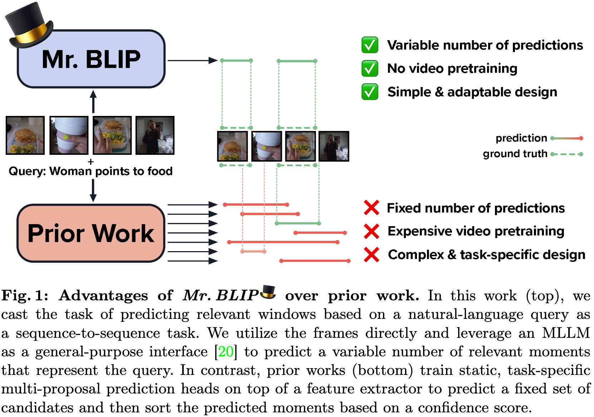
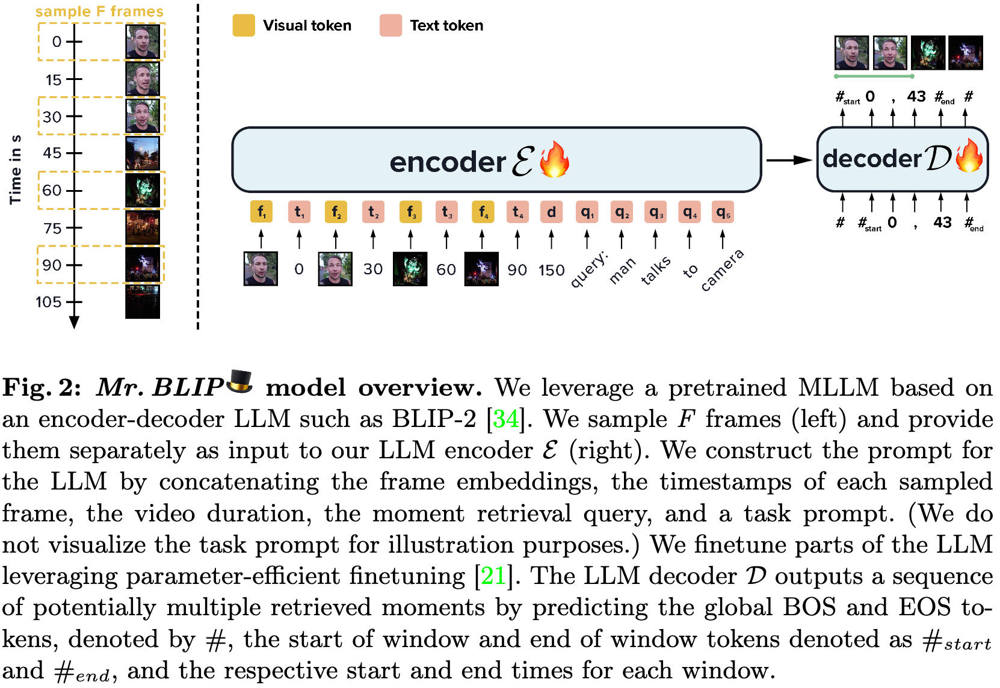

# Chrono: A Simple Blueprint for Representing Time in MLLMs

* Authors: [Boris Meinardus](https://sudo-boris.github.io/), [Hector Garcia Rodriguez](https://hector.gr/), [Anil Batra](https://anilbatra2185.github.io/), [Anna Rohrbach](https://anna-rohrbach.net/), [Marcus Rohrbach](https://rohrbach.vision/)
* Paper: [arxiv](http://arxiv.org/abs/2406.18113)

The recent success of Large Language Models (LLMs) has prompted the extension to the multimodal domain developing image-text Multimodal LLMs (MLLMs) and then video-text models. In this work, we investigate the challenge of contextual and temporal comprehension in video-language models by exploring the task of temporal localization in videos. To address this problem, prior works have developed complex task-specific architectures, novel modules to embed time into MLLMs, or leveraged additional input signals such as video transcripts to best encode contextual and temporal information. Interestingly, we find that most of these efforts are surpassed by a much simpler design. We introduce Chrono, a universal sequence blueprint that can be applied to an image-text pretrained MLLM. Through extensive ablations across different MLLM architectures, finetuning and zero-shot settings, and different datasets, we achieve a new SOTA in moment retrieval on the most widely used benchmarks Charades-STA, QVHighlights, ActivityNet Captions, and grounded video question answering on NeXT-GQA.

<p align="center">
  
</p>

<p align="center">
  
</p>

# Code structure

```bash

# data & data preprocessing
./mr_BLIP_data

# pretrained checkpoints
./mr_BLIP_checkpoints

# mr_BLIP code
./lavis/

# running scripts for mr_BLIP training and inference
./run_scripts

```

# Setup

## Install Dependencies

1. (Optional) Creating conda environment

```bash
conda create -n mrBlip python=3.8
conda activate mrBlip
```

2. build from source

```bash
pip install -r requirements.txt
```

## Download Pretrained Models

We train Mr. BLIP on QVHighlights, Charades-STA, and ActivityNet Captions and provide the checkpoints.
Download the [checkpoints](https://drive.google.com/drive/folders/1AR-rdUillx0fy7KS4zbEuswFMl7qR9Gj?usp=sharing) and put them under /mr_BLIP_checkpoints.

# Dataset Preparation

We test our model on:

* [Charades-STA](https://github.com/jiyanggao/TALL)
  * [Charades (Videos)](https://prior.allenai.org/projects/charades)

* [QVHighlights](https://github.com/jayleicn/moment_detr)

* [ActivityNet Captions](https://cs.stanford.edu/people/ranjaykrishna/densevid/)

Please download original MR data and preprocess them via our [scripts](mr_BLIP_data/data_preprocess.ipynb).

# Inference for Chrono-GPT

## Table 1a:
```
# Row 1 (no duration, no timestamps)
python evaluate.py --cfg-path lavis/projects/mr_gpt4o/eval/qvh_baseline_noDuration_val.yaml

# Row 2 (duration, no timestamps)
python evaluate.py --cfg-path lavis/projects/mr_gpt4o/eval/qvh_baseline.yaml

# Row 3 (no duration, timestamps)
python evaluate.py --cfg-path lavis/projects/mr_gpt4o/eval/qvh_interleave_noDuration.yaml

# Row 4 (duration, timestamps)
python evaluate.py --cfg-path lavis/projects/mr_gpt4o/eval/qvh_interleave_val.yaml
```

## Table 1b:
```
# Row 1 (relative, decimal, suffixed)
python evaluate.py --cfg-path lavis/projects/mr_gpt4o/eval/qvh_timestampsSuffix_decimals_relative.yaml

# Row 2 (absolute, decimal, suffixed)
python evaluate.py --cfg-path lavis/projects/mr_gpt4o/eval/qvh_timestampsSuffix_decimals.yaml

# Row 3 (relative, integer, suffixed)
python evaluate.py --cfg-path lavis/projects/mr_gpt4o/eval/qvh_timestampsSuffix_relative.yaml

# Row 4 (absolute, integer, suffixed)
python evaluate.py --cfg-path lavis/projects/mr_gpt4o/eval/qvh_timestampsSuffix.yaml

# Row 5 (relative, integer, interleaved)
python evaluate.py --cfg-path lavis/projects/mr_gpt4o/eval/qvh_interleave_relative.yaml

# Row 6 (absolute, integer, interleaved)
python evaluate.py --cfg-path lavis/projects/mr_gpt4o/eval/qvh_interleave_val.yaml
```

## Table 2:
```
# Row 9 (GPT4o frames only)
python evaluate.py --cfg-path lavis/projects/mr_gpt4o/eval/qvh_baseline_noDuration.yaml
python evaluate.py --cfg-path lavis/projects/mr_gpt4o/eval/charades_baseline_noDuration.yaml
python evaluate.py --cfg-path lavis/projects/mr_gpt4o/eval/anet_baseline_noDuration.yaml

# Row 10 (Chrono-GPT: absolute interleave timestamps)
python evaluate.py --cfg-path lavis/projects/mr_gpt4o/eval/qvh_interleave.yaml
python evaluate.py --cfg-path lavis/projects/mr_gpt4o/eval/charades_interleave.yaml
python evaluate.py --cfg-path lavis/projects/mr_gpt4o/eval/anet_interleave.yaml
```

## Table 4:
```
# Row 7 (Chrono-GPT: absolute interleave timestamps, single stage)
python evaluate.py --cfg-path lavis/projects/mr_gpt4o/eval/nextGQA_interleave.yaml
```

## Table 7:
```
# Row 1 (relative, decimal, suffixed)
python evaluate.py --cfg-path lavis/projects/mr_gpt4o/eval/charades_timestampsSuffix_decimals_relative.yaml

# Row 2 (absolute, decimal, suffixed)
python evaluate.py --cfg-path lavis/projects/mr_gpt4o/eval/charades_timestampsSuffix_decimals.yaml

# Row 3 (relative, integer, suffixed)
python evaluate.py --cfg-path lavis/projects/mr_gpt4o/eval/charades_timestampsSuffix_relative.yaml

# Row 4 (absolute, integer, suffixed)
python evaluate.py --cfg-path lavis/projects/mr_gpt4o/eval/charades_timestampsSuffix.yaml

# Row 5 (relative, integer, interleaved)
python evaluate.py --cfg-path lavis/projects/mr_gpt4o/eval/charades_interleave_relative.yaml

# Row 6 (absolute, integer, interleaved)
python evaluate.py --cfg-path lavis/projects/mr_gpt4o/eval/charades_interleave_val.yaml

# Row 7 (absolute, decimal, interleaved)
python evaluate.py --cfg-path lavis/projects/mr_gpt4o/eval/charades_interleave_decimals.yaml
```

## Table 8: (almost equivalent to Table 1a)
```
# Row 1 (relative, decimal, suffixed)
python evaluate.py --cfg-path lavis/projects/mr_gpt4o/eval/qvh_timestampsSuffix_decimals_relative.yaml

# Row 2 (absolute, decimal, suffixed)
python evaluate.py --cfg-path lavis/projects/mr_gpt4o/eval/qvh_timestampsSuffix_decimals.yaml

# Row 3 (relative, integer, suffixed)
python evaluate.py --cfg-path lavis/projects/mr_gpt4o/eval/qvh_timestampsSuffix_integer_relative.yaml

# Row 4 (absolute, integer, suffixed)
python evaluate.py --cfg-path lavis/projects/mr_gpt4o/eval/qvh_timestampsSuffix.yaml

# Row 5 (relative, integer, interleaved)
python evaluate.py --cfg-path lavis/projects/mr_gpt4o/eval/qvh_interleave_relative.yaml

# Row 6 (absolute, integer, interleaved)
python evaluate.py --cfg-path lavis/projects/mr_gpt4o/eval/qvh_interleave_val.yaml

# Row 7 (absolute, decimal, interleaved)
python evaluate.py --cfg-path lavis/projects/mr_gpt4o/eval/qvh_interleave_decimals.yaml
```

## Table 9:
```
# Row 1 (no querying for moment retrieval, no Chrono blueprint)
python evaluate.py --cfg-path lavis/projects/mr_gpt4o/eval/nextGQA_baseline_noMRprompt.yaml
# Row 2 (querying for moment retrieval, no Chrono blueprint)
python evaluate.py --cfg-path lavis/projects/mr_gpt4o/eval/nextGQA_baseline.yaml
# Row 3 (querying for moment retrieval, Chrono blueprint)
python evaluate.py --cfg-path lavis/projects/mr_gpt4o/eval/nextGQA_interleave_val.yaml
```


# Acknowledgments

We thank the developers of [LAVIS](https://github.com/salesforce/LAVIS) and [BLIP-2](https://github.com/salesforce/LAVIS/tree/main/projects/blip2) for their public code release.

# Reference

Please cite our paper if you use our models in your works:

```bibtex
@article{meinardus2025chronosimpleblueprintrepresenting,
      title={Chrono: A Simple Blueprint for Representing Time in MLLMs}, 
      author={Boris Meinardus and Hector Garcia Rodriguez and Anil Batra and Anna Rohrbach and Marcus Rohrbach},
      year={2025},
      eprint={2406.18113},
      archivePrefix={arXiv},
      primaryClass={cs.CV},
      url={https://arxiv.org/abs/2406.18113}, 
}
```


